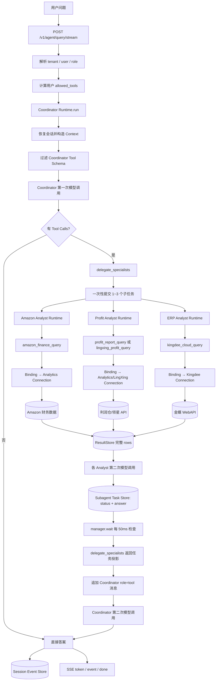
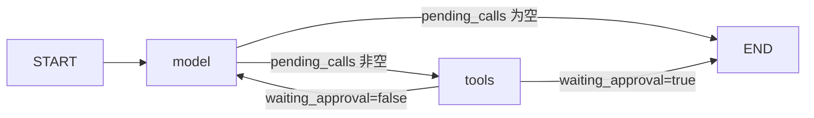
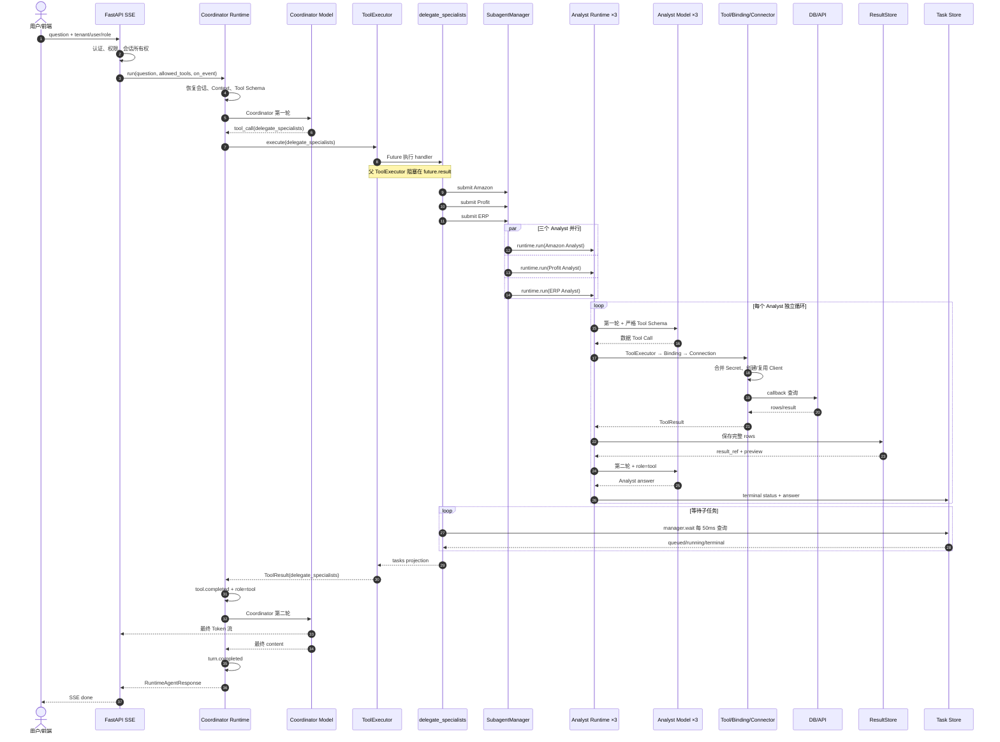

# Multi-Agent Ops Platform：Runtime、Tool、Connector 与多智能体请求全生命周期源码导读

> 源码基线：`328a444594e2943bf8118dd1e5b7093cf7b14ef7`  
> 仓库：[`minijy/multi_agent_ops_platform`](https://github.com/minijy/multi_agent_ops_platform)  
> 范围：Coordinator、专业 Analyst、Tool Execution、Connector、Binding、结果存储、SSE、审批、超时、中断与恢复。

本文按实际调用顺序解释一次请求如何穿过源码。每个关键节点均提供页内跳转和源码跳转，便于对照实现阅读。

## 目录

1. [正确的心智模型](#mental-model)
2. [核心对象与职责](#core-objects)
3. [启动和依赖装配](#startup)
4. [端到端总流程](#full-flow)
5. [HTTP、身份、权限与 SSE](#http-entry)
6. [Runtime 初始化会话](#runtime-init)
7. [模型节点 `_model_node`](#model-node)
8. [工具节点 `_tools_node`](#tools-node)
9. [ToolExecutor 执行边界](#tool-executor)
10. [Tool、Binding、Connection、Connector 的链接](#tool-connector)
11. [三个专业 Analyst 的真实数据分支](#specialists)
12. [`delegate_specialists` 并行委派](#parallel-delegation)
13. [结果如何就绪并触发 Coordinator](#result-ready)
14. [三类存储](#stores)
15. [两层第二轮模型请求](#second-model-turn)
16. [审批、错误、超时、取消与恢复](#exception-branches)
17. [SSE 事件生命周期](#streaming)
18. [完整时序图](#sequence)
19. [逐节点源码索引](#node-index)
20. [关键结论](#conclusions)

---

<a id="mental-model"></a>

## 1. 正确的心智模型

这个项目不是“模型直接连接数据库”，也不是“Tool 自己保存 URL 和密钥”。准确关系是：

```text
Model
  选择 Tool，生成业务参数
        ↓
AgentRuntime / ToolExecutor
  权限、校验、审批、超时、状态机
        ↓
Tool handler
  查询计划、业务约束、结果结构
        ↓
ToolBindingRegistry
  tool_name → connector_type / operation / resource_scope
        ↓
ConnectionRegistry
  tenant Connection + config + secret + resource scopes
        ↓
ConnectorRuntime / Provider
  创建或复用 Client，节流、重试、熔断
        ↓
Tool callback
  使用 Client 执行 SQL 或外部 API
```

多智能体场景包含两层独立循环：

```text
Coordinator：模型 → delegate_specialists → 模型汇总
每个 Analyst：模型 → 数据查询 Tool → 模型分析
```

跨 Amazon、利润和 ERP 的请求通常至少包含 Coordinator 两次模型调用、三个 Analyst 各两次模型调用、三个数据 Tool、三次 Connector 数据访问和一次父级委派 Tool。

---

<a id="core-objects"></a>

## 2. 核心对象与职责

| 对象 | 负责 | 不负责 | 源码 |
|---|---|---|---|
| `AgentRuntime` | 会话、模型/工具状态机、预算、取消、事件 | 具体业务查询 | [`agent_loop.py`](../src/ops_agent/runtime/agent_loop.py) |
| `ToolRegistry` | 注册 Tool、过滤可见 Tool、生成 Schema | 创建外部连接 | [`tools.py#L85`](../src/ops_agent/runtime/tools.py#L85) |
| `ToolExecutor` | 参数校验、Guard、超时、调用 handler | 决定模型选什么 Tool | [`tools.py#L227`](../src/ops_agent/runtime/tools.py#L227) |
| `ToolBindingRegistry` | `tool_name` 到 Connector 的映射与连接选择 | 执行 SQL/API | [`connectors.py#L47`](../src/ops_agent/runtime/connectors.py#L47) |
| `ConnectionRegistry` | 租户 Connection、秘密引用、资源范围 | 向模型暴露密钥 | [`connections.py#L134`](../src/ops_agent/connections.py#L134) |
| `ConnectorRuntime` | Client、节流、重试、熔断、callback | 生成业务查询参数 | [`connectors.py`](../src/ops_agent/runtime/connectors.py) |
| `SubagentManager` | 子任务并行、状态、等待、取消 | 汇总最终回答 | [`subagents.py#L189`](../src/ops_agent/runtime/subagents.py#L189) |
| `ResultStore` | 完整 `rows` 和分页引用 | 判断子 Agent 是否完成 | [`result_store.py#L87`](../src/ops_agent/runtime/result_store.py#L87) |
| Session Event Store | 模型、Tool、子任务和会话事件 | 替代业务结果表 | [`agent_loop.py#L407`](../src/ops_agent/runtime/agent_loop.py#L407) |

### 三个专业 Analyst

| Agent | 职责 | 严格允许的数据 Tool |
|---|---|---|
| `amazon-finance-analyst` | Amazon 结算与费用 | `amazon_finance_query` |
| `profit-analyst` | 利润分析仓与领星实时利润 | `profit_report_query`、`lingxing_profit_query` |
| `erp-analyst` | 金蝶销售与应收 | `kingdee_cloud_query` |

定义见 [`agent_registry.py#L90`](../src/ops_agent/agent_registry.py#L90)。`strict_tool_allowlist=True` 保证专业 Analyst 不能跨领域访问数据 Tool。

---

<a id="startup"></a>

## 3. 启动和依赖装配

请求进入前，[`runtime/stack.py#L110`](../src/ops_agent/runtime/stack.py#L110) 已完成：

1. 创建 `ConnectionRegistry`；
2. 创建 `ToolBindingRegistry`；
3. 创建 `ConnectorRuntime`；
4. 创建 `ToolRegistry`；
5. 注册 Amazon、利润、领星、金蝶等 Tool；
6. 创建带 `ApprovalGuard`、`ConnectorAccessGuard` 的 `ToolExecutor`；
7. 创建 `AgentRuntime`；
8. 创建 `SubagentManager`；
9. 把 `delegate_subagent`、`delegate_specialists` 注册成 Tool。

数据 Tool 通过依赖注入获得同一个 `connector_runtime`，不会自行读取环境变量建立全局连接。

### 默认 Tool Binding

定义于 [`connectors.py#L727`](../src/ops_agent/runtime/connectors.py#L727)：

| Tool | Connector | Operation | Resource Scope |
|---|---|---|---|
| `amazon_finance_query` | `analytics` | `query_settlements` | `marketplace_ids` |
| `profit_report_query` | `analytics` | `query_profit` | `store_names` |
| `lingxing_profit_query` | `lingxing` | `profit_report` | `sids` |
| `kingdee_cloud_query` | `kingdee` | `execute_bill_query` | 无独立 Binding Scope |

`operation` 是目录和治理元数据；真正数据访问逻辑是 Tool 传给 ConnectorRuntime 的 Python callback。

---

<a id="full-flow"></a>

## 4. 端到端总流程



---

<a id="http-entry"></a>

## 5. HTTP、身份、权限与 SSE

入口：[`POST /v1/agent/query/stream`](../src/ops_agent/api/app.py#L1038)。

### H1：解析 Principal

`principal_from_headers()` 解析 `tenant_id`、`user_id`、`role` 和 API Key。tenant 决定数据隔离，user 决定会话所有权，role 参与 Tool 可见性与查询策略。

### H2：计算有效权限

`access_control.effective_access()` 返回用户启用状态和 `allowed_tools`。禁用用户直接返回 `403`，不会进入模型。

### H3：检查 Session 所有权

请求带 `session_id` 时，API 先检查会话属于当前 Principal；Runtime 内部还会再次检查，避免只依赖入口层。

### H4：建立 SSE Queue

API 创建 Queue，把 `emit(item) → events.put(item)` 作为 `on_event` 传入 Runtime。SSE generator 编码为 `event: <type>` 和 `data: <JSON>`。

### H5：后台 Worker

Worker 调用 `agent_runtime.run()`。成功写入 `type=done`，异常写入 `type=error`，最后压入 `None` 结束响应。模型生成与 HTTP 输出因此可以并行进行。

---

<a id="runtime-init"></a>

## 6. Runtime 初始化会话

入口：[`AgentRuntime.run()`](../src/ops_agent/runtime/agent_loop.py#L1538) → [`_run_turn()`](../src/ops_agent/runtime/agent_loop.py#L1773)。

### R1：解析 Agent

顶层默认 Coordinator；子任务显式传入专业 Analyst。Agent 不存在或未启用时立即失败。

### R2：求 Tool 权限交集

```text
Agent allowed_tools
∩ AccessControl allowed_tools
∩ 调用方传入 allowed_tools
∩ Tool allowed_roles / allowed_tenants
```

`run()` 在 [`agent_loop.py#L1592`](../src/ops_agent/runtime/agent_loop.py#L1592) 求前几项交集，`ToolDefinition.visible_to()` 在 [`tools.py#L60`](../src/ops_agent/runtime/tools.py#L60) 完成最终过滤。

### R3：创建或恢复 Session

新会话写入 `session.created`，快照保存 Agent、模型、role、委派深度、Tool 白名单、Connection IDs、Resource Scope、Token Budget 和父会话。源码：[`agent_loop.py#L1996`](../src/ops_agent/runtime/agent_loop.py#L1996)。

权限快照防止恢复旧会话时因后来权限扩大而自动扩大旧会话能力。

### R4：用户消息和附件

非恢复请求持久化 `user.message` 并发送同名 SSE。附件从 Attachment Store 读取，转换为模型可接受的 `image_url` 内容块。

### R5：构造 Prompt 和历史消息

Runtime 组合 Agent System Prompt、权限边界、Memory Snapshot、Skill Catalog、子 Agent 限制、历史消息和当前用户消息。`model.response` 被恢复为 assistant message，`tool.completed` 被恢复为 `role=tool` message。

### R6：创建 RuntimeState

State 保存消息、pending calls、Tool 结果、权限、连接范围、审批、预算、Deadline 和取消信号。字段见 [`agent_loop.py#L151`](../src/ops_agent/runtime/agent_loop.py#L151)。

### R7：进入 LangGraph



构建代码：[`_build_graph()`](../src/ops_agent/runtime/agent_loop.py#L1320)。

---

<a id="model-node"></a>

## 7. 模型节点 `_model_node`

源码：[`agent_loop.py#L993`](../src/ops_agent/runtime/agent_loop.py#L993)。

### M1：控制检查

进入模型前检查取消事件和 Deadline；若已取消或超时，不再消耗模型 Token。

### M2：构造 ToolExecutionContext

`_context()` 注入 session、tenant、user、role、Agent、Tool 白名单、Connection IDs、Resource Scope、Deadline 和取消信号。源码：[`agent_loop.py#L382`](../src/ops_agent/runtime/agent_loop.py#L382)。

### M3：生成可见 Tool Schema

`registry.schemas(context)` 只返回通过权限过滤的函数 Schema。Connector 的 DSN、服务器地址、密钥和 Connection ID不会进入模型上下文。

### M4：模型路由和请求事件

`ModelRouter.route()` 按 `model_id` 和文本/图片模态选择 Provider，随后记录 `model.request`，包含模型、消息数和可见 Tool 名称。

### M5：流式调用模型

`router.invoke(messages, schemas, on_token=...)` 执行模型。公开文本和 reasoning 分别经过流式清洗，再发往 SSE。

### M6：恢复和规范化 Tool Call

Runtime 会修复“声称搜索但未调用 Tool”“声称委派但未调用 Tool”等情况，规范化委派参数，并在专业模式中把多个专业委派合并为最多三项的 `delegate_specialists`。

### M7：再次验证 Tool 可见性

模型请求不在本次 Schema 中的 Tool 会被移除并记录 `model.tool_call_rejected`。如果全部被拒绝，Runtime 生成明确权限错误。

### M8：预算与最大轮数

累计 Token 超过预算时清空 Tool Call并设为 `budget_exceeded`；达到 `max_tool_steps` 时停止继续调用 Tool。

### M9：写入 model.response

持久化清洗后的 content、reasoning、Tool Calls 和 usage，再把 assistant message 与 `pending_calls` 写回 State。

### 模型节点主要分支

| 分支 | 条件 | 后续 |
|---|---|---|
| 直接回答 | 没有 Tool Call | `_route_after_model → END` |
| Coordinator 委派 | 返回 `delegate_specialists` | 进入 tools 节点并启动 Analyst |
| Analyst 查数 | 返回专业数据 Tool | 进入 tools 节点并访问 Connector |
| 不可见 Tool | Tool 不在 Schema | 拒绝并记录事件 |
| Token 超限 | 超过预算 | 状态 `budget_exceeded`，结束 |
| Tool 轮数超限 | 达到 `max_tool_steps` | 清空调用，结束 |
| Provider 错误 | 模型请求失败 | 记录 `model.error` 并向 API 抛出 |

---

<a id="tools-node"></a>

## 8. 工具节点 `_tools_node`

源码：[`agent_loop.py#L1181`](../src/ops_agent/runtime/agent_loop.py#L1181)。

### T1：顺序读取 pending calls

实现使用 `for raw_call in state["pending_calls"]`，因此同一模型响应中的普通 Tool Calls 默认顺序执行。`concurrency_safe=True` 是能力元数据，当前 `_tools_node` 没有据此并行批量执行。

### T2：Tool 查找与可见性检查

`registry.get(call.name, context)` 再次检查 Tool 是否存在以及对当前 Principal 是否可见。失败时生成 `ok=False` 的 ToolResult，并追加错误 Tool Message，让模型有机会解释或调整。

### T3：记录请求事件

写入 `tool.requested`，内容包括 `call_id`、Tool 名和业务参数。

### T4：审批分支

若 `requires_approval=True` 且本次 `call_id` 未获批：

1. Governance Store 创建 Approval；
2. 写入 `approval.requested`；
3. State 设置 `waiting_approval=True`；
4. 图在 tools 节点后结束，不进入下一轮模型。

Amazon、利润和金蝶只读查询 Tool 默认不需要审批，但 Runtime 的通用工具链支持此分支。

### T5：调用 ToolExecutor

`executor.execute(call, context)` 统一返回 ToolResult。成功或失败最终都会形成与原 `tool_call_id` 对应的 `role=tool` 消息。

### T6：清洗公开输出

Tool 输出和错误经过 `sanitize_public_value()` / `sanitize_public_text()`，避免内部敏感信息直接进入模型或前端。

### T7：物化查询结果

成功结果若是包含 `rows` 的字典，调用 `materialize_tool_output()`：完整行数据写 ResultStore，模型只收到摘要、统计、预览和 `result_ref`。

### T8：追加 Tool Message

写入 `tool.completed` 后追加：

```python
{
    "role": "tool",
    "tool_call_id": call.call_id,
    "name": call.name,
    "content": json.dumps(model_content),
}
```

### T9：路由下一节点

- `waiting_approval=True`：`tools → END`；
- 否则：`tools → model`，携带新的 Tool Message 进入下一轮模型。

---

<a id="tool-executor"></a>

## 9. ToolExecutor 执行边界

源码：[`runtime/tools.py#L227`](../src/ops_agent/runtime/tools.py#L227)。

### E1：解析 ToolDefinition

再次从 Registry 读取 Tool，防止调用方绕过外围权限过滤。

### E2：参数强校验

`arguments_model.model_validate(call.arguments)` 把模型 JSON 转为强类型计划：

- [`AmazonFinanceQueryPlan`](../src/ops_agent/workflows/amazon_finance/domain.py#L19)；
- [`ProfitReportQueryPlan`](../src/ops_agent/workflows/profit_report/domain.py#L19)；
- [`KingdeeQueryPlan`](../src/ops_agent/workflows/kingdee_cloud/domain.py#L30)。

非法日期、枚举、limit 和额外字段会在访问 Connector 前失败。

### E3：执行 Guard

`ApprovalGuard` 检查逐次审批；`ConnectorAccessGuard` 解析 Tool 实际 Connection，并验证它位于委派给当前 Runtime 的 `connection_ids` 中。

### E4：计算有效超时

有效超时取 ToolDefinition 超时与当前 Runtime Deadline 剩余时间的较小值。

### E5：执行 handler

```python
future = pool.submit(definition.handler, arguments, context)
output = future.result(timeout=timeout)
```

单线程池用于隔离和超时控制，并不使多个 pending calls 并行。

### E6：统一 ToolResult

正常返回包装为 `ok=True`。未知 Tool、ValidationError、PermissionError、TimeoutError 和其他异常均转换为 `ok=False`，保持模型消息协议完整。

---

<a id="tool-connector"></a>

## 10. Tool、Binding、Connection、Connector 的链接

### C1：Tool handler 定义业务 callback

以 [`profit_report_tool.py#L33`](../src/ops_agent/runtime/profit_report_tool.py#L33) 为例：

```python
def query(client, connection):
    # 校验 tenant
    # 解析授权店铺
    # 创建业务 QueryTool
    # 执行参数化查询
    return resolved_plan, rows, total

return connectors.execute_tool(
    context.tenant_id,
    "profit_report_query",
    query,
)
```

Tool 只提交 `tenant_id`、`tool_name` 和 callback，不读取 Connection 密钥。

### C2：Binding Registry 选择 Connection

[`resolve_connection()`](../src/ops_agent/runtime/connectors.py#L214) 的顺序：

1. 根据 `tool_name` 找到 ToolBinding；
2. 查询 `tenant_id:tool_name` 是否显式绑定 Connection；
3. 有显式选择时使用指定 Connection；
4. 否则使用该租户同类型默认 Connection；
5. 验证 tenant、Connector 类型、enabled 和配置完整性。

因此 `amazon_finance_query` 和 `profit_report_query` 即使都使用 `analytics`，也可以分别绑定不同数据库 Connection。

### C3：合并配置和秘密

`ConnectionDefinition` 保存普通 `config`、`secret_ref` 和 `resource_scopes`。执行时 [`resolved_values()`](../src/ops_agent/connections.py#L465) 合并：

```python
{
    **connection.config,
    **secret_store.get(connection.secret_ref),
}
```

Analytics DSN、领星/金蝶 `app_secret` 等秘密字段不会进入模型参数。

### C4：Provider 创建或复用 Client

- Analytics Provider：校验 DSN 与数据库类型；
- LingXing Provider：创建 `LingXingClient`；
- Kingdee Provider：构造 `KingdeeCredentials` 和 `KingdeeClient`。

源码：[`connectors.py#L283`](../src/ops_agent/runtime/connectors.py#L283)。Client 按 Connection ID 和配置指纹缓存，配置变化会触发重建。

### C5：资源范围计算

资源权限不是模型参数，而是以下范围的交集：

```text
Connection.resource_scopes
∩ Tool Binding 选择的 resource_scopes
∩ 父 Agent 委派给子 Agent 的 resource_scope
```

Amazon 使用 `marketplace_ids`，分析仓利润使用 `store_names`，领星使用 `sids`。模型不能通过 Tool 参数扩大范围。

### C6：Connector 执行 callback

[`_execute_connection()`](../src/ops_agent/runtime/connectors.py#L606) 依次：

1. 检查 Connection 级熔断；
2. 按 Provider 最小间隔节流；
3. 获取或创建 Client；
4. 调用 `operation(client, connection)`；
5. 成功时清零失败状态；
6. 瞬时错误指数退避重试；
7. 连续失败达到阈值时开启熔断。

### C7：同步返回链

```text
数据源返回 rows
→ query callback return
→ ConnectorRuntime._execute_connection return
→ ConnectorRuntime.execute_tool return
→ Tool handler return
→ ToolExecutor.future.result 得到 output
→ _tools_node 得到 ToolResult
```

Connector callback 是同步数据函数，不是通知 Coordinator 的回调。

---

<a id="specialists"></a>

## 11. 三个专业 Analyst 的真实数据分支

### 11.1 Amazon Finance Analyst

```text
amazon-finance-analyst
→ amazon_finance_query
→ analytics Binding
→ tenant Analytics Connection
→ marketplace_ids 权限交集
→ AmazonFinanceQueryTool
→ 参数化聚合查询
→ RELEASED rows
```

源码：[`amazon_finance_tool.py#L38`](../src/ops_agent/runtime/amazon_finance_tool.py#L38)。

处理节点：

- `enforce_query_plan()` 按 role 限制查询计划；
- 校验 Connection tenant 与 Principal 一致；
- `scoped_tool_resources()` 计算授权站点交集；
- 查询仅针对 `RELEASED` 结算数据；
- 返回 summary、data scope 和 calculation 元数据。

### 11.2 Profit Analyst：分析仓分支

```text
profit-analyst
→ profit_report_query
→ analytics Binding
→ tenant Analytics Connection
→ store_names 授权解析
→ ProfitReportQueryTool
→ 参数化利润查询
```

源码：[`profit_report_tool.py#L33`](../src/ops_agent/runtime/profit_report_tool.py#L33)。

`resolve_tool_resource()` 验证模型指定的 `store_name`。只有一个授权店铺时可以自动注入；有多个授权店铺而请求不明确时拒绝模糊访问。

### 11.3 Profit Analyst：领星实时分支

```text
profit-analyst
→ lingxing_profit_query
→ lingxing Binding
→ tenant LingXing Connection
→ sids 权限范围
→ LingXingClient
→ 领星实时利润 API
```

源码：[`lingxing_profit_tool.py`](../src/ops_agent/runtime/lingxing_profit_tool.py)。该分支用于实时领星数据；已入仓分析优先使用 `profit_report_query`。

### 11.4 ERP Analyst

```text
erp-analyst
→ kingdee_cloud_query
→ kingdee Binding
→ tenant Kingdee Connection
→ KingdeeCredentials / KingdeeClient
→ KingdeeQueryTool
→ ExecuteBillQuery
```

源码：[`kingdee_cloud_tool.py#L18`](../src/ops_agent/runtime/kingdee_cloud_tool.py#L18)。`KingdeeQueryPlan` 只允许销售订单、销售出库、普通应收和费用应收，模型不能传任意 FormId。

---

<a id="parallel-delegation"></a>

## 12. `delegate_specialists` 并行委派

实现：[`subagents.py#L605`](../src/ops_agent/runtime/subagents.py#L605)。

### D1：运行模式

只有 `analyst_mode="specialized_parallel"` 才允许该 Tool；通用模式使用 `delegate_subagent`。

### D2：一次性提交任务

`tasks` 限制 1～3 项。handler 先完成所有 `manager.submit()`，再进入等待，所以任务执行可并行。

### D3：子 Agent Tool 权限

[`_resolved_tools()`](../src/ops_agent/runtime/subagents.py#L270) 会：

- 读取目标 Agent 严格白名单；
- 与用户权限求交集；
- 拒绝不可见 Tool；
- 不继承需要逐次审批的 Tool；
- 达到最大深度时移除继续委派能力。

### D4：子 Agent Connection Scope

[`_resolved_connection_scope()`](../src/ops_agent/runtime/subagents.py#L335) 确保 Connection 属于当前 tenant，且子资源范围只能等于或小于父级范围。

### D5：创建 TaskRecord

每个任务获得独立 `task_id`、`child_session_id`、Agent、目标、模型、预算、超时、Tool 白名单、Connection IDs 和 Resource Scope，初始状态为 `queued`，随后记录 `subagent.started`。

### D6：LangGraph 异步并行

Inline Backend 在专用 asyncio loop 上调度 compiled subgraph 的 `ainvoke`，并用 `Semaphore(subagent_worker_count)` 限制并发。并行的是多个状态隔离的 Analyst 子图，不是父 `_tools_node` 的普通 pending calls。

### D7：子 Agent 进入 compiled subgraph

Inline 调度器和 DB Worker 都调用 `LangGraphSubagent.ainvoke()`。子图按 `prepare → agent → finalize` 执行；`agent` 节点进入 `runtime.run()`，因此每个 Analyst 有独立生命周期状态、模型—Tool—模型循环和 child session。

---

<a id="result-ready"></a>

## 13. 结果如何就绪并触发 Coordinator

### 13.1 Analyst 数据结果就绪

数据 Tool callback 同步返回后，ToolExecutor 得到 ToolResult；`_tools_node` 追加 `role=tool` 消息；LangGraph 从 `tools` 回到 `model`；Analyst 第二次模型调用生成最终自然语言 `answer`。

### 13.2 子任务最终结果就绪

子图的 `agent` 节点返回后，`finalize` 节点更新：

```text
status = response.status
answer = response.answer
completed_at = now
```

并写入 `subagent.finished`。这才是 Analyst 任务层面的结果就绪。

### 13.3 Manager 如何发现就绪

[`manager.wait()`](../src/ops_agent/runtime/subagents.py#L509) 每 50ms 查询 Subagent Task Store：

```text
status 为终态 → 返回 TaskRecord
超过 deadline → 返回当前 TaskRecord
否则 sleep(0.05) 后继续
```

当前实现是状态轮询，不是 Analyst 主动 callback Coordinator。

### 13.4 为什么顺序 wait 仍是并行

`delegate_specialists` 虽然用 `for task in submitted` 依次 wait，但所有任务已在此之前提交到 Worker Pool。等待第一个任务时，其他 Future 仍在并行运行。

### 13.5 返回给 Coordinator 的内容

`task_projection()` 只返回 `task_id`、`child_session_id`、`agent_id`、`status`、截断后的 `answer` 和 `error`。Coordinator 默认不会直接拿到三个数据源的完整 rows。

### 13.6 Coordinator 如何解除阻塞

父 ToolExecutor 正阻塞于：

```python
output = future.result(timeout=timeout)
```

当 `delegate_specialists()` 返回后：

1. `future.result()` 解除阻塞；
2. 输出包装为 `ToolResult(ok=True)`；
3. Coordinator 写入 `tool.completed`；
4. 追加 `role=tool, name=delegate_specialists` 消息；
5. `_route_after_tools()` 返回 `model`；
6. Coordinator 第二次模型调用开始。

恢复执行来自同步 handler 返回和 LangGraph 条件边，不存在额外“唤醒 Coordinator”回调。

---

<a id="stores"></a>

## 14. 三类存储

| 存储 | 保存内容 | 在流程中的作用 |
|---|---|---|
| ResultStore | 数据 Tool 的完整 rows、统计、质量、`result_ref` | 分页与完整数据保留；不唤醒 Coordinator |
| Subagent Task Store | queued/running/terminal、answer、error | `manager.wait()` 判断 Analyst 是否就绪 |
| Session Event Store | session/model/tool/subagent/turn 事件 | 审计、恢复、状态查询和部分 SSE |

### 14.1 ResultStore

[`materialize_tool_output()`](../src/ops_agent/runtime/result_store.py#L172) 只处理“字典且包含 list 类型 rows”的输出：

1. 计算 statistics 和 data quality；
2. 完整 payload 写入 `agent_tool_results`；
3. 生成 `result_ref` 和分页 endpoint；
4. 返回有限预览行给模型。

`delegate_specialists` 输出没有顶层 `rows`，因此不会按查询结果方式物化。

### 14.2 Subagent Task Store

TaskRecord 是子任务状态的事实来源。终态通常包括 completed、failed、cancelled、timed_out、waiting_approval、budget_exceeded。

### 14.3 Session Event Store

主要事件：

```text
session.created
user.message
model.request / model.response / model.error
tool.requested / tool.completed
approval.requested
subagent.started / subagent.running / subagent.finished
turn.interrupted / turn.completed
```

恢复会话时，Runtime 根据这些事件重建 assistant Tool Calls 和对应 Tool Messages。

---

<a id="second-model-turn"></a>

## 15. 两层第二轮模型请求

### 15.1 Analyst 第二轮

```json
[
  {"role": "system", "content": "你是 Profit Analyst..."},
  {"role": "user", "content": "查询 8 月利润报表毛利润"},
  {
    "role": "assistant",
    "content": "",
    "tool_calls": [{
      "id": "call-profit-001",
      "function": {
        "name": "profit_report_query",
        "arguments": {"metric": "overview", "start_date": "...", "end_date": "..."}
      }
    }]
  },
  {
    "role": "tool",
    "tool_call_id": "call-profit-001",
    "name": "profit_report_query",
    "content": "{\"summary\":\"...\",\"result_ref\":\"result-...\",\"rows\":[...]}"
  }
]
```

Analyst 据此生成业务结论并完成 TaskRecord。

### 15.2 Coordinator 第二轮

```json
[
  {"role": "system", "content": "你是 Coordinator..."},
  {"role": "user", "content": "对比 Amazon、利润和 ERP 数据"},
  {
    "role": "assistant",
    "content": "",
    "tool_calls": [{
      "id": "call-delegation-001",
      "function": {"name": "delegate_specialists", "arguments": {"tasks": [...]}}
    }]
  },
  {
    "role": "tool",
    "tool_call_id": "call-delegation-001",
    "name": "delegate_specialists",
    "content": "{\"tasks\":[{\"agent_id\":\"...\",\"status\":\"completed\",\"answer\":\"...\"}]}"
  }
]
```

Coordinator 根据各 Analyst 的 answer 对齐时间和业务口径，并处理失败或超时任务。

项目使用 assistant `tool_calls` + `role=tool/tool_call_id` 消息协议，而非 Responses API 的 `function_call_output` item。

---

<a id="exception-branches"></a>

## 16. 审批、错误、超时、取消与恢复

### 16.1 Tool 不存在或不可见

模型节点会提前拒绝隐藏 Tool；工具节点和 Registry 再次校验。失败结果以 Tool Message 返回模型，形成双重防线。

### 16.2 参数校验失败

Pydantic ValidationError 转换为 `ok=False`，Connector 不会被调用。

### 16.3 Connection 失败

包括 Connection 不属于 tenant、类型不匹配、被禁用、配置不完整、Secret 缺失或超出子 Agent 的 Connection Scope。

### 16.4 资源越权

未授权 marketplace、store 或 sid 在 callback 执行业务查询前被拒绝。Scope 只能收窄，不能通过委派扩大。

### 16.5 Connector 瞬时错误与熔断

网络错误、超时和部分 429/5xx 会指数退避重试；连续失败达到阈值后开启 Connection 级熔断窗口。

### 16.6 Tool 超时

`future.result(timeout)` 超时后设置取消事件、尝试取消 Future，并返回失败 ToolResult。

### 16.7 子任务超时

`delegate_specialists` 使用共享 Deadline。`manager.wait()` 到期会返回当前记录，所以 Coordinator 可能收到 queued/running，而不保证全是 completed；最终模型必须明确缺失结果。

### 16.8 高风险审批

需要审批时创建 Approval Record，状态转为 `waiting_approval` 并退出当前图。批准恢复后，原 `call_id` 进入 `approved_call_ids` 才能执行。

### 16.9 用户取消

取消事件传入父 Runtime 和子任务。SubagentManager 设置对应 Event 并尝试取消 Future；模型和 Tool 在控制检查点停止。

### 16.10 可恢复中断

流式请求设置 `interruption_is_resumable=True`。中断时写入 `turn.interrupted`。恢复时：

1. 读取 Session Events；
2. 还原 assistant Tool Calls 和 Tool Messages；
3. 补齐缺失 Tool Result；
4. 保留原权限与 Connection Scope 快照；
5. 从已有状态继续。

### 16.11 预算和递归保护

Token Budget 控制模型消耗，`max_tool_steps` 控制工具轮次，Graph 使用 `recursion_limit=max_tool_steps*2+4` 提供额外保护。

---

<a id="streaming"></a>

## 17. SSE 事件生命周期

典型父会话顺序：

```text
user.message
model.request
token / reasoning
model.response                  # 含 delegate_specialists
tool.requested                  # 开始委派
...等待子任务...
tool.completed                  # 委派结果返回
model.request                   # Coordinator 第二轮
token / reasoning               # 最终回答流
model.response
turn.completed
done
```

### 写入顺序

[`_append_event()`](../src/ops_agent/runtime/agent_loop.py#L407) 先持久化，再 `_emit_stream()`，避免前端先看到一个完全未保存的事件。

### 子 Agent Token 限制

子图的 `agent` 节点调用 `runtime.run()` 时没有传父请求 `on_event`，所以三个 Analyst 内部 Token 不会原样透传到父 SSE。父前端主要看到 Coordinator Token、父 Runtime 事件、委派完成状态和 `done`。

### 流式并非最后才开始

Coordinator Token 在生成期间即时进入 SSE；`done` 只表示最终 RuntimeResponse 已完整形成。

---

<a id="sequence"></a>

## 18. 完整时序图



---

<a id="node-index"></a>

## 19. 逐节点源码索引

### API 与依赖装配

- Runtime Stack：[`runtime/stack.py#L110`](../src/ops_agent/runtime/stack.py#L110)
- 同步入口：[`api/app.py#L994`](../src/ops_agent/api/app.py#L994)
- SSE 入口：[`api/app.py#L1038`](../src/ops_agent/api/app.py#L1038)

### Agent 与权限

- 默认 Agent：[`agent_registry.py#L57`](../src/ops_agent/agent_registry.py#L57)
- Agent Prompt/Tool 集：[`agent_roles.py`](../src/ops_agent/agent_roles.py)
- Tool 可见性：[`tools.py#L60`](../src/ops_agent/runtime/tools.py#L60)
- Agent Tool Policy：[`agent_tool_policy.py`](../src/ops_agent/runtime/agent_tool_policy.py)

### Runtime 状态机

- RuntimeState：[`agent_loop.py#L151`](../src/ops_agent/runtime/agent_loop.py#L151)
- Context：[`agent_loop.py#L382`](../src/ops_agent/runtime/agent_loop.py#L382)
- Event 与 Stream：[`agent_loop.py#L407`](../src/ops_agent/runtime/agent_loop.py#L407)
- Model Node：[`agent_loop.py#L993`](../src/ops_agent/runtime/agent_loop.py#L993)
- Tools Node：[`agent_loop.py#L1181`](../src/ops_agent/runtime/agent_loop.py#L1181)
- Graph 路由：[`agent_loop.py#L1312`](../src/ops_agent/runtime/agent_loop.py#L1312)
- `run()`：[`agent_loop.py#L1538`](../src/ops_agent/runtime/agent_loop.py#L1538)
- `_run_turn()`：[`agent_loop.py#L1773`](../src/ops_agent/runtime/agent_loop.py#L1773)

### Tool Execution

- ToolExecutionContext：[`tools.py#L16`](../src/ops_agent/runtime/tools.py#L16)
- ToolDefinition：[`tools.py#L40`](../src/ops_agent/runtime/tools.py#L40)
- ToolRegistry：[`tools.py#L85`](../src/ops_agent/runtime/tools.py#L85)
- ConnectorAccessGuard：[`tools.py#L197`](../src/ops_agent/runtime/tools.py#L197)
- ToolExecutor：[`tools.py#L227`](../src/ops_agent/runtime/tools.py#L227)

### Connector 与 Connection

- Connection 模型：[`connections.py#L60`](../src/ops_agent/connections.py#L60)
- Secret Fields/Registry：[`connections.py#L134`](../src/ops_agent/connections.py#L134)
- 合并 Config 与 Secret：[`connections.py#L465`](../src/ops_agent/connections.py#L465)
- ToolBindingRegistry：[`connectors.py#L47`](../src/ops_agent/runtime/connectors.py#L47)
- Connection 选择：[`connectors.py#L214`](../src/ops_agent/runtime/connectors.py#L214)
- Connector Provider：[`connectors.py#L283`](../src/ops_agent/runtime/connectors.py#L283)
- 执行/重试/熔断：[`connectors.py#L597`](../src/ops_agent/runtime/connectors.py#L597)
- 默认 Binding：[`connectors.py#L727`](../src/ops_agent/runtime/connectors.py#L727)

### 专业数据 Tool

- Amazon Finance：[`amazon_finance_tool.py#L38`](../src/ops_agent/runtime/amazon_finance_tool.py#L38)
- Profit Report：[`profit_report_tool.py#L33`](../src/ops_agent/runtime/profit_report_tool.py#L33)
- LingXing Profit：[`lingxing_profit_tool.py`](../src/ops_agent/runtime/lingxing_profit_tool.py)
- Kingdee Cloud：[`kingdee_cloud_tool.py#L18`](../src/ops_agent/runtime/kingdee_cloud_tool.py#L18)

### 子 Agent

- 委派参数：[`subagents.py#L29`](../src/ops_agent/runtime/subagents.py#L29)
- 子任务 Worker：[`subagents.py#L79`](../src/ops_agent/runtime/subagents.py#L79)
- SubagentManager：[`subagents.py#L189`](../src/ops_agent/runtime/subagents.py#L189)
- 权限与 Scope：[`subagents.py#L270`](../src/ops_agent/runtime/subagents.py#L270)
- 提交任务：[`subagents.py#L381`](../src/ops_agent/runtime/subagents.py#L381)
- 等待与取消：[`subagents.py#L509`](../src/ops_agent/runtime/subagents.py#L509)
- 委派 Tool：[`subagents.py#L605`](../src/ops_agent/runtime/subagents.py#L605)
- 专业并行委派：[`subagents.py#L679`](../src/ops_agent/runtime/subagents.py#L679)

### 结果存储

- ResultStore：[`result_store.py#L87`](../src/ops_agent/runtime/result_store.py#L87)
- 结果物化：[`result_store.py#L172`](../src/ops_agent/runtime/result_store.py#L172)
- 分页读取：[`result_store.py#L224`](../src/ops_agent/runtime/result_store.py#L224)

---

<a id="conclusions"></a>

## 20. 关键结论

1. **Tool 不拥有连接。** Tool 使用注入的 ConnectorRuntime，连接、秘密和 Client 生命周期由 Connection/Connector 层负责。
2. **模型看不到密钥。** 模型只收到 Tool 名、描述和业务参数 Schema；tenant、Connection 和资源权限由可信 Context 注入。
3. **callback 是同步业务函数。** 它返回查询结果，不负责通知 Coordinator。
4. **Coordinator 不是被事件回调唤醒。** 父 ToolExecutor 等待 `delegate_specialists` 返回，然后 LangGraph 通过 `tools → model` 启动第二轮。
5. **并行发生在 Agent 级。** 三个 Analyst 通过 Worker Pool 并行；普通 pending Tool Calls 当前仍顺序执行。
6. **原始数据分层传递。** 完整 rows 留在 ResultStore，Analyst 收到预览和引用，Coordinator 收到 Analyst answer 投影。
7. **存在三层权限。** Tool Allowlist、tenant/Connection 可见性、marketplace/store/sid Resource Scope 任一失败都会阻止访问数据源。
8. **事件存储支撑恢复。** Tool Calls、Tool Results 和权限快照使 Runtime 能在中断后重建消息链。

## 一句话总结

```text
Coordinator 用 Tool Call 发起并行委派；
Analyst 用 Tool Call 表达业务查询；
Tool 用 Binding 找到 Connector；
Connector 用租户 Connection 创建 Client 并同步执行 callback；
Analyst 把查询结果转为结论并更新 TaskRecord；
delegate_specialists 等待任务终态后返回；
LangGraph 把返回值作为 role=tool 消息送入 Coordinator 第二轮模型；
最终答案和生命周期事件通过 SSE 返回前端。
```
